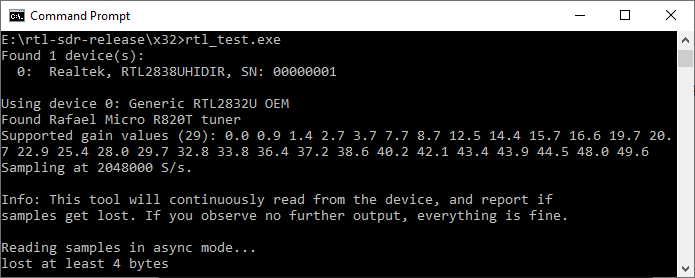
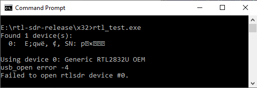

# Equipo

### USB 2,0 Software Radio DVB-T RTL2832U + R820T2 SDR

- R820T2 + RTL2832U chip;
- 24 - 1766 MHz (depende de la antena);
- Apoyo SDR, DAB, FM, DVB-T;
- Control remoto;
- Linux + Windows;
- MPEG-2, MPEG-4 (H.264);

Incluye:
- 1x DVB-T
- 1x antena
- 1x Control remoto
- 1x mini CD 

# Software

## Windows: instalación de drivers

Ve a la carpeta [drivers](drivers) y ejecuta **windows-realtek-setup.exe**, la herramienta de instalación de drivers. 

Estos son los mismos que vendrán en el CD.

Para probar si funciona la instalación, usa la herramienta **win_rtl_tester.zip**. 

Debería de salir algo así:

### Instrucciones especiales para Windows 10

Windows 10 añade... un desafío algo más grande. Es probable que te encuentres con un mensaje así:

Tienes que descargarte [zadig 2.4](https://zadig.akeo.ie/) para cambiar los drivers, como se explica en este vídeo:

https://www.youtube.com/watch?v=LWyswHcE5dU

**¡CUIDADO!** Debes escoger el driver correcto o puedes hacer daño irreparable a tu ordenador.

### Descargar el software SDR-Sharp 

Para escuchar transmisiones de radio, ve a [https://airspy.com/download/](https://airspy.com/download/) y descarga el **Windows SDR Software Package**.

## Linux: instalación de drivers y herramientas

Dependiendo de la distribución. Un RTL2832U requiere el driver `rtl-sdr` y posiblemente alguno más.

Después, para visualizar y escuchar, se requiere el paquete gqrx.

## OSX: instalacion

https://www.radiohobbyist.org/blog/?p=1823
