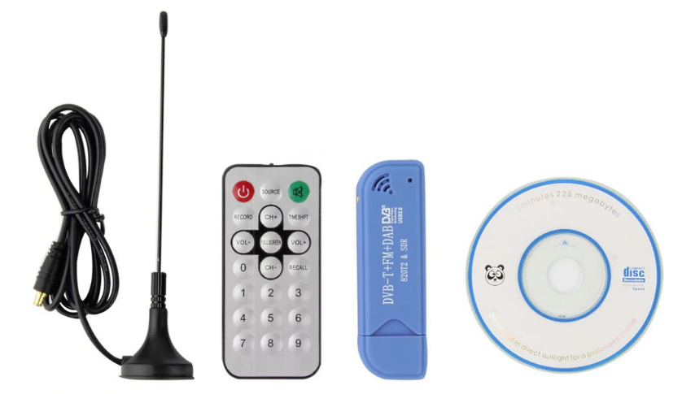
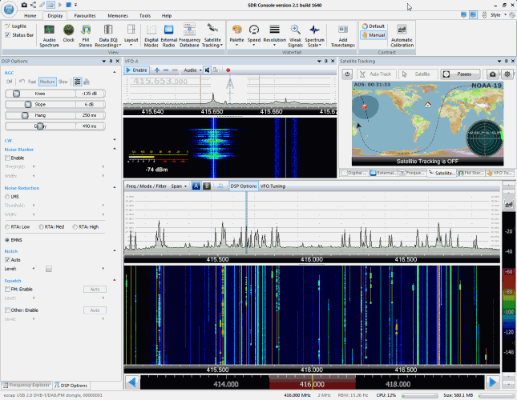

# Equipo

### USB 2,0 Software Radio DVB-T RTL2832U + R820T2 SDR

- R820T2 + RTL2832U chip;
- 24 - 1766 MHz;
- Apoyo SDR, DAB, FM, DVB-T;
- Control remoto;
- Windows 2000/XP/Vista/WIN7;
- MPEG-2, MPEG-4 (H.264);

Incluye:
- 1x DVB-T
- 1x antena
- 1x Control remoto
- 1x mini CD 

# Software

